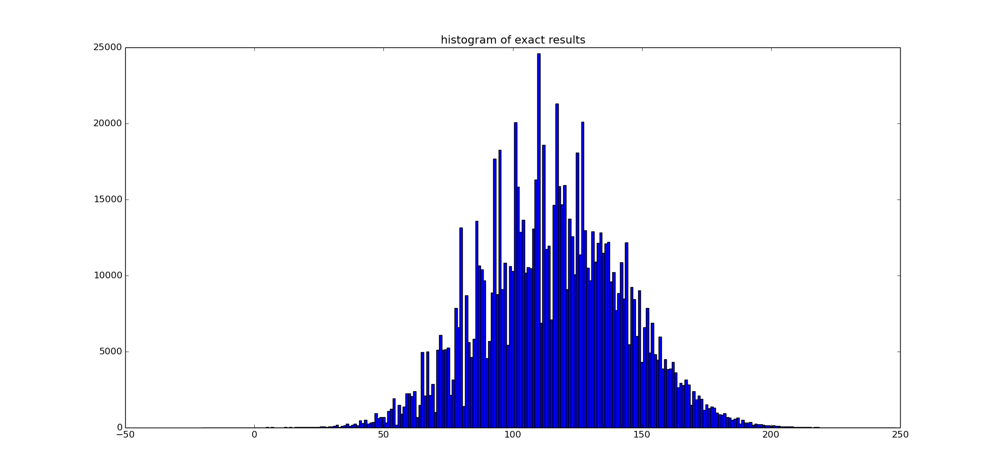

# qwixxmaster

A command line qwixx game

## About

The current version  of **qwixxmaster** is only for the solitar mode: only one player tries to maximize the result. The use of the results for evaluation for moves in a game of two or more players is only of limited advantage, because the algorithm does not take the strategy of the other player into the acccount - which is a very important aspect of the game.

For the calculation, the dynamic programming is used. After utilizing all symmetries there are `2*10^7` states, 2/3 of which can not be reached, because the game ends before they can be reached, so only about `6*10^6` must be calculated and for every state about `3*10^4` combination of dices to be evaluated. Which is feasible within one or two days on a sigle core. An alternative approach is to try out only some of the combination for every state (e.g. 100 or 1000).

## How to use

To build **qwixxmaster**:
    
    make
    
To run:

    bin/qwixxmaster

or 

    make run
    
To find more information type:

    >>>help
    
in the qwixxmaster terminal.
    
### Advanced usage

For using more than 2 (default, which is pretty small to get meaningful results) random dice rolls to evaluate a state:

    bin/qwixxmaster -s N
    
For `N=0` every possible dice roll will be used for the evaluation, otherwise only random `N`.

For loading a dynamic programming memory, stored by a previous run of the program:

    bin/qwixxmaster -m <memory file>
 
Use

   make create_memory 
   
to create a perfect strategy for the solitar game. Wait for one or two days to get results:)
    
## Results so far

### One player

The brute force calculation yields `115.911` points as expected result for a perfect strategy. 
If one doesn't use the brute force evaluation of the underling dice roll distribution but approximates it with 1000 random rolls so the calculated expectation is `116.175`. However in a run of `10^6` simulated games, the 1000-approximation can not score as expected: on average it scores only `115.91 +/- 0.03` - the error of the estimation is statistically significant.

For the exact calculation the average score was `115.96 +/- 0.03` and thus slightly better than predicted (but still inside of 2*sigma deviation), so one could conclude  that the expectation gets confirmed.

That is what the point distribution looks like:

There is .001% probability to end up with negative score and 0.086% probability to get more than 200 points. The most probable result is 110. Looking at the head-to-head comparison between the exact and 1000-approximation, the score is  50.4% : 49.6% and 67% of games ending with the same number of points.

Compared to other approximations:

| approximation | expected | achieved | score with exact |
|---------------|----------|----------|------------------|
| exact         | 115.91   |  115.96  |   50.0:50.0      |
| 1000          | 116.18   |  115.91  |   50.4:49.6      |
| 100           | 117.13   |  115.16  |   52.8:47.2      |
| 10            | 118.31   |  110.30  |   61.0:39.0      |
| 2             | 160.84   |   83.19  |   81.6:18.4      |
 

Approximations 1000 and 100 can be used for practical purposes without much precision loss, approximation 10 is already of a worse quality.

